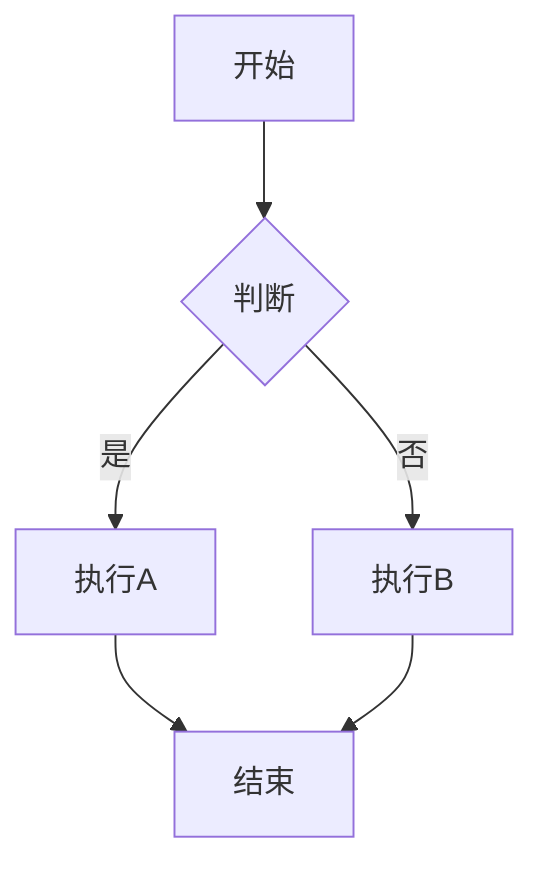
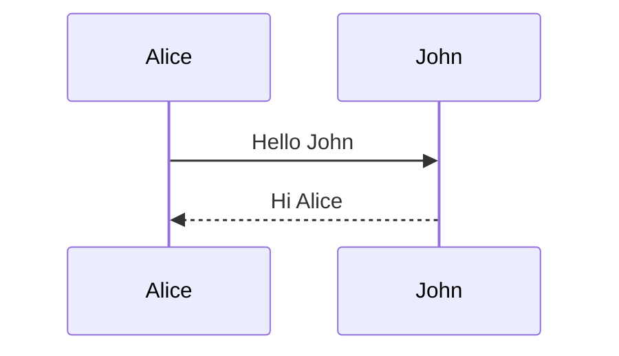

# Markdown 增强指南

@ldesign/docs-generator v3.0 提供了与 VitePress 完全兼容的 Markdown 增强功能。

---

## 容器

### 提示容器

```markdown
::: tip 提示
这是一个提示容器
:::

::: tip 自定义标题
可以自定义标题
:::
```

::: tip 示例
这是一个提示容器的效果展示
:::

### 警告容器

```markdown
::: warning 注意
这是一个警告容器
:::
```

::: warning 注意
请注意这个重要信息
:::

### 危险容器

```markdown
::: danger 危险
这是一个危险警告容器
:::
```

::: danger 危险
这个操作可能导致数据丢失！
:::

### 详情容器

```markdown
::: details 点击展开查看详情
这里是隐藏的详细内容
:::
```

::: details 点击展开查看详情
这里是隐藏的详细内容，默认折叠
:::

### 信息容器

```markdown
::: info 信息
这是一个信息容器
:::
```

---

## 代码块增强

### 行号显示

默认情况下，所有代码块都会显示行号：

````markdown
```typescript
function hello() {
  console.log('Hello World')
}
```
````

禁用行号：

````markdown
```typescript:no-line-numbers
function hello() {
  console.log('Hello World')
}
```
````

### 行高亮

高亮特定行：

````markdown
```typescript {2,4-6}
function example() {
  const a = 1  // 高亮
  const b = 2
  const c = 3  // 高亮
  const d = 4  // 高亮
  const e = 5  // 高亮
}
```
````

### 代码组

支持多个代码块的 tab 切换：

````markdown
::: code-group

```typescript [config.ts]
export default {
  title: 'TypeScript Config'
}
```

```javascript [config.js]
module.exports = {
  title: 'JavaScript Config'
}
```

```json [config.json]
{
  "title": "JSON Config"
}
```

:::
````

使用自定义标题：

````markdown
::: code-group

```ts title="推荐配置"
export default { /* ... */ }
```

```ts title="最小配置"
export default { /* ... */ }
```

:::
````

---

## 代码块功能

### 代码块标题

````markdown
```typescript title="utils/helper.ts"
export function helper() {
  return 'Helper function'
}
```
````

### 聚焦特定行（计划中）

````markdown
```typescript
export default {
  data() {
    return {
      msg: 'Focused!' // [!code focus]
    }
  }
}
```
````

### 代码差异显示（计划中）

````markdown
```typescript
export default {
  data() {
    return {
      msg: 'removed' // [!code --]
      msg: 'added' // [!code ++]
    }
  }
}
```
````

---

## 导入代码片段

### 导入整个文件

```markdown
@[code](./snippet.ts)
```

### 导入指定行

```markdown
@[code{1-10}](./snippet.ts)
```

### 导入单行

```markdown
@[code{5}](./snippet.ts)
```

---

## Emoji 支持

使用 `:emoji_name:` 语法：

```markdown
:tada: :rocket: :sparkles: :fire:
```

效果：🎉 🚀 ✨ 🔥

常用 Emoji：
- `:tada:` - 🎉
- `:rocket:` - 🚀
- `:sparkles:` - ✨
- `:fire:` - 🔥
- `:bug:` - 🐛
- `:wrench:` - 🔧
- `:package:` - 📦
- `:memo:` - 📝
- `:bulb:` - 💡
- `:warning:` - ⚠️

---

## 自定义锚点

### 自动锚点

所有标题会自动生成锚点：

```markdown
## 这是标题

链接到: [这是标题](#这是标题)
```

### 自定义锚点 ID

```markdown
## 我的标题 {#custom-id}

链接到: [自定义锚点](#custom-id)
```

---

## 链接

### 内部链接

```markdown
[快速开始](/guide/quick-start)
[API 参考](../api/core)
```

### 外部链接

外部链接会自动添加图标和 `target="_blank"`：

```markdown
[GitHub](https://github.com)
[Vue.js](https://vuejs.org)
```

---

## 在 Markdown 中使用 Vue 组件

### 导入组件

```markdown
<script setup>
import CustomComponent from './components/CustomComponent.vue'
</script>

# 我的页面

<CustomComponent :msg="'Hello'" />
```

### 使用内置组件

```markdown
<Badge type="tip">v3.0</Badge>
<Badge type="warning">实验性</Badge>
<Badge type="danger">已废弃</Badge>
```

---

## 表格

### 基础表格

```markdown
| 列1 | 列2 | 列3 |
|-----|-----|-----|
| A   | B   | C   |
| D   | E   | F   |
```

### 对齐

```markdown
| 左对齐 | 居中对齐 | 右对齐 |
|:-------|:--------:|-------:|
| A      | B        | C      |
```

---

## 任务列表

```markdown
- [x] 已完成的任务
- [ ] 待完成的任务
- [ ] 另一个任务
```

效果：
- [x] 已完成的任务
- [ ] 待完成的任务
- [ ] 另一个任务

---

## GitHub 风格警告

```markdown
> [!NOTE]
> 强调用户在略读文档时应注意的信息。

> [!TIP]
> 帮助用户成功的可选信息。

> [!IMPORTANT]
> 用户成功所需的关键信息。

> [!WARNING]
> 因潜在风险需要用户立即注意的关键内容。

> [!CAUTION]
> 行为的潜在负面后果。
```

---

## 数学公式（需要 KaTeX 插件）

### 行内公式

```markdown
这是行内公式 $E = mc^2$
```

### 块级公式

```markdown
$$
\frac{n!}{k!(n-k)!} = \binom{n}{k}
$$
```

---

## Mermaid 图表（需要 Mermaid 插件）

### 流程图

````markdown

````

### 序列图

````markdown

````

---

## 脚注

```markdown
这是一段文字[^1]，这是另一段[^2]。

[^1]: 这是脚注1的内容
[^2]: 这是脚注2的内容
```

---

## 高级技巧

### 转义

如果需要显示 Markdown 语法本身：

```markdown
\::: tip
这不会被解析为容器
\:::
```

### 代码块中的 Vue 模板

在代码块中使用 Vue 模板语法时，无需转义：

````markdown
```vue
<template>
  <div>{{ message }}</div>
</template>
```
````

### 多行代码导入

```markdown
@[code ts{1-10,15-20}](./example.ts)
```

---

## 完整示例

```markdown
---
title: Markdown 示例
description: 展示所有 Markdown 功能
---

# Markdown 示例

::: tip 提示
这个页面展示了所有 Markdown 增强功能
:::

## 代码示例

::: code-group

```typescript [TypeScript]
const msg: string = 'Hello'
console.log(msg)
```

```javascript [JavaScript]
const msg = 'Hello'
console.log(msg)
```

:::

## 功能清单

- [x] 容器语法
- [x] 代码增强
- [x] Emoji 支持
- [ ] 更多功能开发中...

支持 Emoji :tada: :rocket:

## 自定义锚点 {#custom}

可以使用 `{#id}` 创建自定义锚点。

## 外部链接

访问 [GitHub](https://github.com) 查看源码。
```

---

## 参考

- [Markdown-it 插件](https://github.com/markdown-it/markdown-it)
- [VitePress Markdown](https://vitepress.dev/guide/markdown)
- [GitHub Flavored Markdown](https://github.github.com/gfm/)

