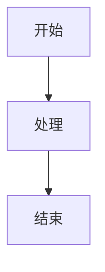

# 测试文档

这是一个测试文档，用于验证 @ldesign/docs-generator 的功能。

## 功能特性

- ✅ API 文档自动生成
- ✅ 组件文档提取
- ✅ Markdown 渲染
- ✅ 搜索功能
- ✅ 多主题支持

## 示例代码

```typescript
function hello(name: string): string {
  return `Hello, ${name}!`
}
```

## Mermaid 图表



## 数学公式

行内公式: $E = mc^2$

块级公式:
$$
\int_0^\infty e^{-x^2} dx = \frac{\sqrt{\pi}}{2}
$$

